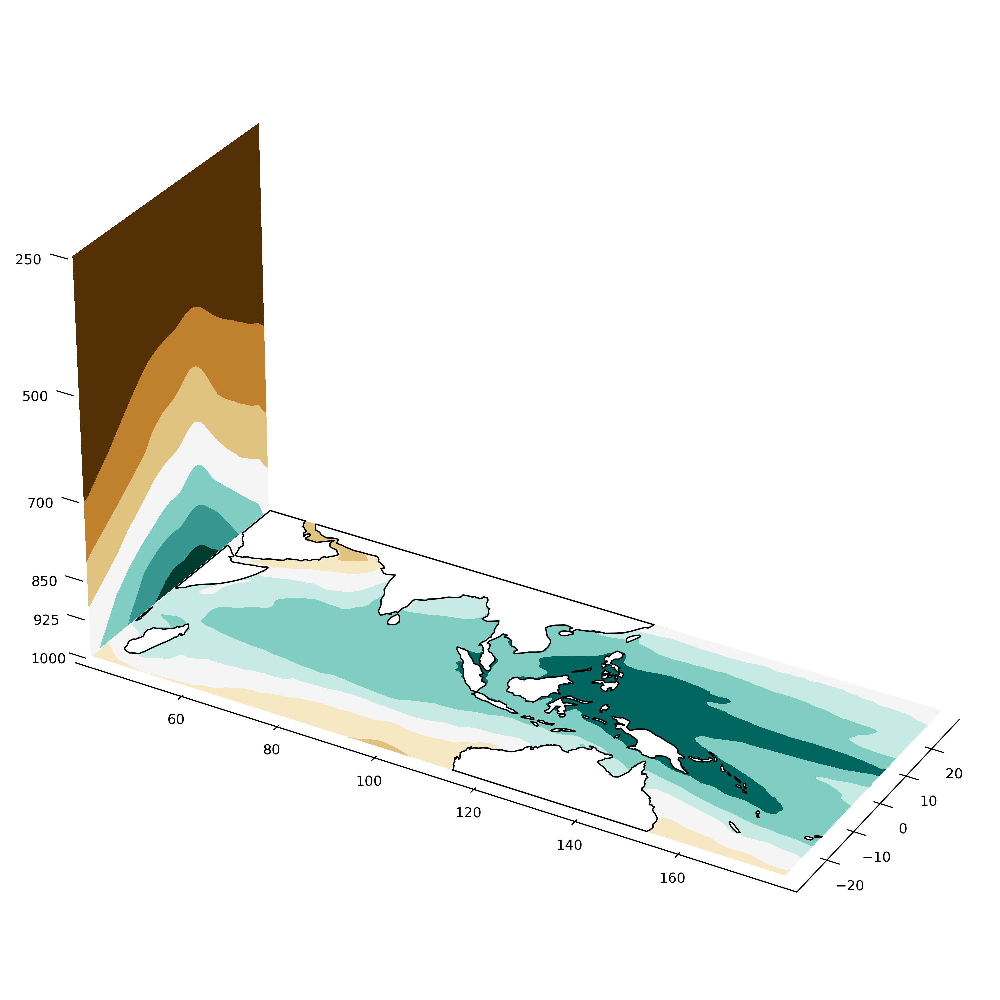

# schematic-3d

This repository demonstrates how to draw 3-dimensional schematic with matplotlib Axes3D and cartopy.

Since Axes3D and cartopy are not integrated systematically for now, we do a little bit hacking here to plot the coastlines on Axes3D. Checkout the [stack overflow answer](https://stackoverflow.com/questions/23785408/3d-cartopy-similar-to-matplotlib-basemap) by Phil Elson for the details.

Phil's github: https://github.com/pelson

